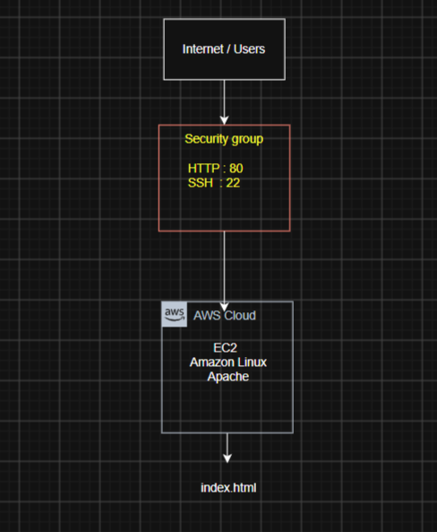
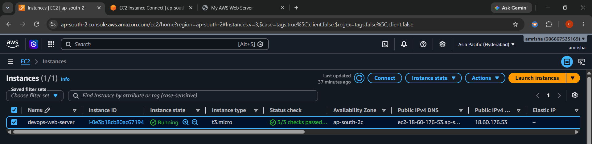
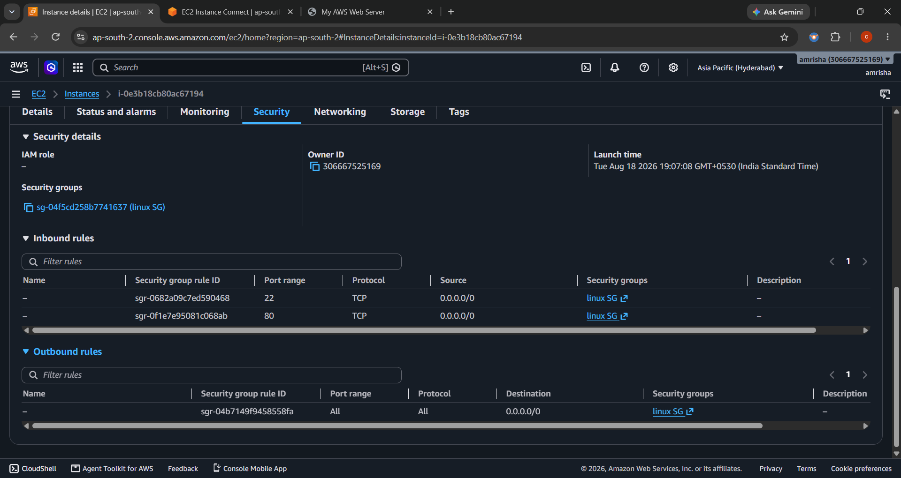
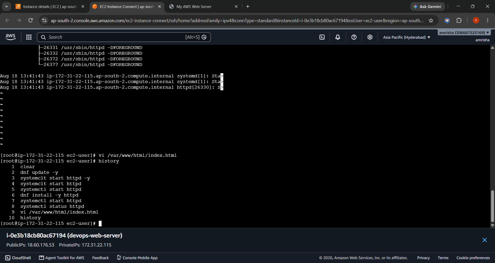
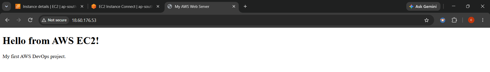

# AWS EC2 Web Server

Deploying an Apache web server on Amazon EC2 using Security Groups, with a User Data script created for automation.
This project demonstrates how I deployed a simple Apache web server on an Amazon EC2 instance using Amazon Linux.
I launched and configured an EC2 instance, set up a Security Group, installed Apache, and hosted a simple HTML webpage.

## Architecture



## AWS Services & Tools Used

- Amazon EC2
- Amazon Linux
- Security Groups
- Apache HTTP Server
- EC2 Instance Connect
- Git
- GitHub
  
 ## What I Did

1. Launched an Amazon Linux EC2 instance.
2. Configured a Security Group with SSH (port 22) and HTTP (port 80).
3. Connected to the instance using EC2 Instance Connect.
4. Installed Apache HTTP Server.
5. Started and enabled the Apache service.
6. Created a custom `index.html` webpage.
7. Hosted the webpage using Apache.
8. Accessed the website through the EC2 public IPv4 address.
9. Documented the setup with screenshots and an architecture diagram.

 ## Apache Installation

I used the following commands to install and start Apache:

```bash
sudo dnf update -y
sudo dnf install -y httpd
sudo systemctl start httpd
 ```

## Screenshots

### EC2 Instance



### Security Group



### EC2 Terminal



### Working Website



## Automation

The repository also contains a `user-data.sh` script that can automate the Apache installation when launching an EC2 instance.

For this project, I configured the EC2 instance manually using EC2 Instance Connect and created the script separately as an automation step.

## What I Learned

- Launching and configuring an EC2 instance
- Connecting to a Linux server using EC2 Instance Connect
- Basic Linux commands
- Configuring AWS Security Groups
- Installing and managing Apache
- Hosting a webpage on EC2
- Using Git and GitHub for version control

## Cleanup

The EC2 instance should be stopped or terminated after testing to avoid unnecessary AWS charges.
sudo systemctl enable httpd
